<!-- 🌈 HEADER SECTION -->

  

<h2 align="center">✨ AI & MERN Stack Developer | Robotics Enthusiast | Dreaming in Code 💫</h2>

  

---

### 🪩 **About Me**

  

    
  

  
  👋 Hi there! I’m <b>Harshita Kushwaha</b> — a <b>B.Tech (Hons.) CSE</b> student with a <b>Robotics minor</b>.  
  I love combining <b>AI intelligence</b> and <b>MERN stack creativity</b> to design smart systems.  
  I’m passionate about <b>Deep Learning, NLP, and scalable automation systems</b>.  
  
  🌱 Currently exploring <b>LangChain</b> and <b>AI-driven Web Automation</b>  
  💬 Ask me about <b>AI models, MERN apps, or full-stack project architecture</b>  
  ⚡ Fun Fact: I debug my life one bug at a time 🐞  
  
  

---

### 🪄 **Connect With Me**

  
  
  
  

---

### ⚙️ **Tech Stack**

    
  
  

---

### 💫 **Featured Projects**

  <table>
    <tr>
      <td width="33%">
        
        <h3>🩸 RAKT - Blood Bank Management System</h3>
        
Token + GPS-based MERN system with AI donor tracking, reducing allocation time by 30%.

        <a href="https://github.com/hars123KHU/RAKT-Blood-Bank-Management-System"><b>🔗 View Repo</b></a>
      </td>
      <td width="33%">
        
        <h3>🧬 DiagnoseAI</h3>
        
AI Medical Assistant that predicts conditions from symptoms using NLP.

        <a href="https://github.com/hars123KHU/DiagnoseAI-AI-Medical-System-"><b>🔗 View Repo</b></a>
      </td>
      <td width="33%">
        
        <h3>💬 ChatterBox</h3>
        
Real-time encrypted MERN chat app with sleek responsive UI.

        <a href="https://github.com/hars123KHU/ChatterBox-Secure-Chat-System"><b>🔗 View Repo</b></a>
      </td>
    </tr>
  </table>

---

### 🚀 **Career Journey**

```mermaid
timeline
    title Harshita's Tech Journey
    2024 : 🌐 Web Developer Intern - BharatIntern
    2025 : 🤖 AI Intern - Edunet
    2025 : 💻 Software Developer - ProdigyInfotech
    2025 : 🧠 Research Paper - RAKT AI Blood Bank System

```

<!-- ⚡ GITHUB STATS & ACTIVITY -->
<h2 align="center">⚡ GitHub Analytics & Activity ⚡</h2>

  
  

  

---

<!-- 🏆 TROPHIES & ACHIEVEMENTS -->
<h2 align="center">🏆 Achievements & Highlights 🏆</h2>

  

---

<!-- 🐍 CONTRIBUTION SNAKE -->
<h2 align="center">🐍 My Contribution Snake 🐍</h2>

  

---

<!-- ✨ QUOTE OF THE DAY -->
<h2 align="center">✨ Quote of the Day ✨</h2>

  

---

  

